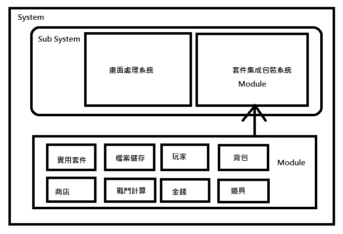
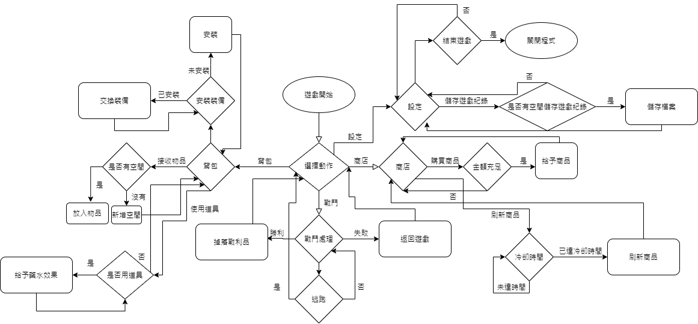

# 期末專題企畫書
## 程式介紹
- 名稱：😴掛機RPG⚔️小遊戲🎮
- 說明：一種可以開啟來掛機的小遊戲，可以購買裝備等一些物品及道具，來由玩遊戲。
## 架構圖

## 流程圖

## 開發人員、參與人員 與 組別資料
- 組別：第七組   
- 組員：
    - 王福賢(圖片素材、畫面設計)
    - 宋佳瑋(撰寫程式碼)
    - 王郁恩(書面文件)
## 功能
- 商店(防具、武器、道具)
- 掛機
- 檔案儲存
- 道具(補血、力量、體力)
- 武器(兩把[新手、專家]) 
- 金錢
- 等級
- 血量
- 防禦
- 防具(兩套整套[新手、專家])
- 怪物掉落(金錢、經驗) 
- 彩蛋(?)
## 開發進度
- 畫面設計(10%)
- 程式設計(5%)
## 計畫項目
> ### **符號說明**
> - ⭕完成
> - 💼進行中
> - ❌未完成
- 進行中
    - [💼]戰鬥
- 未進行
    - [⭕]商店(防具、武器、道具)
    - [⭕]掛機
    - [⭕]檔案儲存
    - [⭕]道具(補血、力量、體力)
    - [⭕]武器(兩把[新手、專家]) 
    - [⭕]金錢
    - [⭕]等級
    - [⭕]血量
    - [⭕]防禦
    - [⭕]防具(兩套整套[新手、專家])
    - [⭕]怪物掉落(金錢、經驗) 
    - [⭕]彩蛋(?)
- 已完成
    - 無
